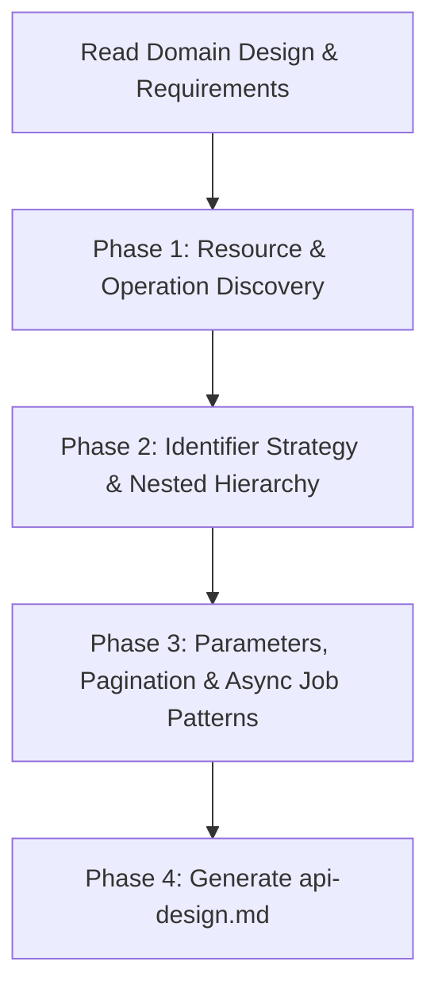

# REST API Design Skill

This skill translates domain design, architectural decisions, and functional requirements into a rigorous, technology-agnostic **REST API specification** (`api-design.md`).

It applies the principles defined in [*Designing REST APIs in Practice*](https://medium.com/stackademic/designing-rest-apis-in-practice-a-kubernetes-case-study-fd376334f6ba):
1. **Clean Architecture / DDD perspective**: Entities at the center, then Use Cases, then external REST interfaces.
2. **API as a Contract (Notary metaphor)**: The API designer acts like a notary drafting explicit terms of interaction conforming strictly to HTTP standard rules.
3. **Framework Independence**: The design is technology-neutral (valid for FastAPI, Spring Boot, Go, Express, ASP.NET Core, etc.).
4. **Interactive Co-Design**: Not all domain entities or fields should be exposed. Bob iteratively collaborates with the user to select exposed resources, relationships, identifiers, pagination models, asynchronous job contracts, and filtering capabilities.

---

## Input Prerequisites

1. **`domain-design.md` (Primary Input — required)**:
   - Aggregates, Entities, Value Objects, Identifiers, Domain Events, State transitions.
2. **`architecture.md` (required)**:
   - System boundaries, deployment scopes (e.g. cluster vs tenant vs namespace), non-functional constraints (rate limits, background jobs, caching, data volume).
3. **`requirements.md` (recommended)**:
   - User stories, functional use cases, business rules, acceptance criteria.

---

## Step 0 — Check Prerequisites

Before doing anything else, verify that the required input documents are present.

### 0.1 — Domain design (required)

```
glob: docs/domain-design/README.md
glob: docs/domain-design.md
```

Read whichever exists (folder README takes priority).

**If not found:**
- Stop immediately and tell the user:
  _"No domain design found. `/api-design` requires `docs/domain-design.md` to identify the
  aggregates, entities, and value objects that will be exposed as REST resources. Please run
  `/domain-design` first, then come back and run `/api-design`."_
- Do not proceed further.

**If found:**
- Extract: domain name, entities, aggregates, value objects, domain events, state transitions,
  bounded contexts, last updated date.
- Keep these facts — they seed Phase 1 (Resource & Operation Discovery).

### 0.2 — Architecture document (required)

```
glob: docs/architecture/README.md
glob: docs/architecture.md
```

Read whichever exists (folder README takes priority).

**If not found:**
- Stop immediately and tell the user:
  _"No architecture document found. `/api-design` requires `docs/architecture.md` to understand
  system boundaries, deployment scope, and non-functional constraints (pagination, background jobs,
  caching). Please run `/architecture` first, then come back and run `/api-design`."_
- Do not proceed further.

**If found:**
- Extract: architecture pattern, deployment target, background processing strategy, performance
  constraints, DB engine, async model.
- Keep these facts — they inform pagination strategy, async job patterns, and endpoint constraints
  in Phase 3.

### 0.3 — Requirements document (recommended)

```
glob: docs/requirements/README.md
glob: docs/requirements.md
```

Read whichever exists (folder README takes priority).

**If found:**
- Extract: actors, job stories, business constraints, acceptance criteria, non-functional requirements.
- Use these to drive Phase 1 (which operations are needed) and Phase 3 (filter/sort parameters).

**If not found:**
- Note to the user: _"No requirements document found. Consider running `/requirements` first —
  it helps identify actors, operations, and constraints that shape the API design. Proceeding
  without it."_
- Continue — requirements are recommended but not mandatory.

### 0.4 — Existing API design

```
glob: docs/api-design.md
```

**If found:**
- Extract: API version, base URL, resources already specified, last updated date.
- **Propagation check:** if `docs/domain-design` or `docs/architecture` were updated more recently,
  warn: _"⚠️ Upstream documents were updated after this API design. Review changes before
  proceeding."_
- Tell the user: _"I found an existing API design. It covers these resources: `<list>`.
  Last updated: `<date>`."_
- Ask:

  ```
  ask_followup_question: "What would you like to do?"
  suggestion_a: "Add new endpoints or resources"
  suggestion_b: "Refine existing endpoint specifications"
  suggestion_c: "Start a brand-new API design (discard the current one)"
  ```

  Jump to the appropriate phase. Do NOT repeat phases already confirmed.

**If not found:** proceed normally through the phases.

---

## Interactive Design Process (Step-by-Step)

The skill follows a 4-phase interactive process:



### Phase 1: Resource & Operation Discovery (Interactive)
1. Read `domain-design.md`, `requirements.md`, and `architecture.md`.
2. Extract all domain Aggregates, Entities, and Value Objects.
3. **Propose an initial exposure table and discuss with the user**:
   - Which Aggregates / Entities should be exposed as first-class public resources?
   - Which entities/value objects remain internal implementation details or embedded children?
   - For each exposed resource, which operations are needed:
     - Standard CRUD (`GET`, `POST`, `PUT`, `PATCH`, `DELETE`)
     - Non-CRUD Actions / State Transitions (modeled as `POST /api/v1/{resource}/{id}/{action}`)

### Phase 2: Identifier Strategy & Nested Relationships (Interactive)
1. **Identifier Strategy (Security & Cleanliness)**:
   - **Never expose internal database auto-increment integer IDs** (prevents enumeration attacks, ID scraping, and coupling with storage).
   - Use public identifiers: **business codes/slugs** (e.g., `code="aB3x9zK"`, `slug="my-post"`), or random public UUIDs/NanoIDs/ULIDs.
2. **Nested Relationships & Scopes**:
   - **Scope-based nesting**: e.g., `/api/v1/namespaces/{namespace}/pods`
   - **Parent-Child nesting**: e.g., `/api/v1/customers/{customer_id}/orders`
   - **Hard Rule**: Limit relationship depth to **maximum 2 entities** (e.g., `/parents/{parent_id}/children`). Deeper relations must be flattened with query filters (e.g., `/api/v1/comments?task_id=123`).

### Phase 3: Parameters, Pagination & Asynchronous Job Patterns (Interactive)
Clarify how clients query collections and interact with heavy operations:
1. **URL (Path) Parameters**: Resource identification only (`/{id}`, `/{code}`).
2. **Pagination Strategy**:
   - **Offset-Based** (`?page=1&page_size=20` or `?limit=20&offset=0`): Best for standard UI lists with page jump navigation ($< 100\text{k}$ records).
   - **Cursor-Based** (`?last_id=xyz&limit=100` or `?cursor=token`): Mandatory for high-volume append-only streams (logs, events, large audits) ensuring constant $O(1)$ query cost.
3. **Query Parameters (Filtering & Sorting)**:
   - Exact filters: `?status=active&category=programming`
   - Range / Comparison filters: `?created_after=2026-01-01`
   - Sorting: `?sort=-created_at,title`
4. **Asynchronous Job Submission Pattern (Long-Running Tasks > 2s)**:
   - When an operation represents heavy work (exports, report generation, complex batch jobs), design an asynchronous job contract:
     - `POST /api/v1/{resource}/jobs` $\rightarrow$ Responds with `202 Accepted`, payload containing `job_id`, `status: queued`, and polling endpoint.
     - `GET /api/v1/{resource}/jobs/{job_id}` $\rightarrow$ Returns current progress and status (`queued`, `processing`, `completed`, `failed`), plus result link when ready.
5. **Streaming Contract**:
   - Specify whether an endpoint streams raw binary or chunked tabular data (CSV/NDJSON) via streaming media types (`text/csv`, `application/x-ndjson`).

### Phase 4: Output Deliverable Generation
Generate and write `api-design.md` adhering to the standard template.

---

## Core API Design Rules

### 1. Resource Modeling & Endpoints
- **Plural nouns for resource collections**: Always use plural nouns for collections (e.g., `/api/v1/links`, `/api/v1/namespaces/{namespace}/pods`).
- **Maximum nesting depth of 2 entities**: Limit paths to 2 entities max.
- **API Versioning**: Prefix endpoints with API version (e.g. `/api/v1/...`).
- **Actions/Operations as Sub-resources or POST**: State transitions use `POST /api/v1/{resource}/{id}/{action}`.

### 2. HTTP Methods & Semantics
- `GET`: Retrieve a resource or collection. **Idempotent**, **safe**.
- `POST`: Create a new resource or execute a non-CRUD action. **Non-idempotent**, **mutates state**.
- `PUT`: Complete replacement of resource state. **Idempotent**.
- `PATCH`: Partial update of specific fields.
- `DELETE`: Remove a resource. **Idempotent**.

### 3. HTTP Status Codes Matrix
- `200 OK`: Successful retrieval (`GET`), update (`PUT`, `PATCH`), or synchronous action.
- `201 Created`: Resource successfully created (`POST`), accompanied by `Location` header or resource payload.
- `202 Accepted`: Asynchronous operation or background job initiated.
- `204 No Content`: Successful deletion (`DELETE`) or operation without response body.
- `307 Temporary Redirect` / `302 Found`: Resource redirection (e.g., URL shortener resolving).
- `400 Bad Request`: Validation errors, malformed payload, schema mismatch.
- `401 Unauthorized`: Missing or invalid authentication token/credentials.
- `403 Forbidden`: Authenticated user lacks permission/role in target scope.
- `404 Not Found`: Target resource or route does not exist.
- `405 Method Not Allowed`: HTTP verb not supported for this endpoint.
- `409 Conflict`: Business rule violation, duplicate unique key, or conflicting entity state.
- `422 Unprocessable Entity`: Semantic/business validation failure.
- `429 Too Many Requests`: Rate limit exceeded.
- `500 Internal Server Error`: Unhandled server-side unexpected exception.
- `503 Service Unavailable`: Dependent downstream service/database temporarily unreachable.

### 4. Standardized Error Response Contract
```json
{
  "success": false,
  "error": "Short Error Category or Code",
  "details": [
    "field_name -> Error explanation message"
  ]
}
```

---

## Output Deliverable: `api-design.md` Structure

```markdown
# REST API Specification: [Project Name]

## 1. Overview & Architectural Context
- API Version & Base URL conventions
- Identifier Strategy (Public ID vs internal ID)
- Authentication & Authorization Context (Roles, Scopes, Anonymous routes)
- Pagination & Streaming Conventions (Offset vs Cursor, Export formats)

## 2. Resource Hierarchy & Endpoint Map
Table mapping Domain Entities -> REST Endpoints -> HTTP Methods.

## 3. Detailed Endpoint Specifications
For each endpoint:
### `[METHOD] /api/v1/[path]`
- **Tag / Category**: Entity Name
- **Summary**: One-line purpose
- **Description**: Detailed behavior, business rules, and background execution model
- **Parameters**:
  - Path parameters (name, type, description)
  - Query parameters (name, type, default, validation)
  - Header parameters (if applicable)
- **Request Body**:
  - JSON schema with field types, required fields, constraints
- **Responses**:
  - `200` / `201` / `202` / `204` / `307` Success schema with example JSON
  - `400` / `404` / `409` Error responses with example JSON

## 4. Asynchronous Job & Polling Contracts (if applicable)
- `POST /api/v1/[resource]/jobs` -> `202 Accepted` specification
- `GET /api/v1/[resource]/jobs/{job_id}` -> Polling status and result format

## 5. Standard Error Envelopes & Codes
- Global exception mappings and status code matrix.

## 6. OpenAPI / Swagger Tagging & Organization
- Grouping strategy for interactive API docs.
```
