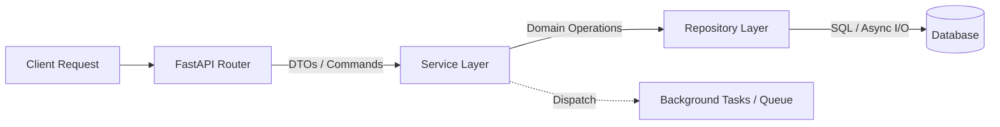

# Python REST API Implementation Skill (FastAPI)

This skill translates a technology-agnostic REST API specification from `docs/api-design.md` into clean, production-grade Python API code using **FastAPI** (or other modern Python web frameworks), strictly respecting the project's chosen architecture and organisation style defined in `docs/architecture.md`.

---

## 1. Input Prerequisites

| Document | Status | Purpose |
|---|---|---|
| `docs/api-design.md` | **Required** | Endpoints, HTTP methods, parameters, status codes, pagination, async job contracts, response schemas |
| `docs/architecture.md` | **Required** | Architecture pattern, organisation style, background processing strategy, folder layout, DB drivers, async model |
| `docs/domain-design.md` | **Required** | Domain models, business invariants, aggregates, entities, value objects, domain exceptions |
| `docs/db-design.md` / `sql/schema.sql` | **Required** (if API uses DB) | Table names, column names, FK relationships |
| `src/<pkg>/models/` + `src/<pkg>/repositories/` | **Required** (if API uses DB) | ORM models and repositories produced by `/python-db` |
| `config.yaml` & `Settings` | **Recommended** | Centralized configuration via `pydantic-settings` |

---

## Step 0 — Check Prerequisites

Before generating any code, verify that all required documents are present.

### 0.1 — API design (required)

```
glob: docs/api-design.md
```

**If not found:**
- Stop immediately and tell the user:
  _"No API design found. `/python-api` requires `docs/api-design.md` as its primary specification.
  Please run `/api-design` first to produce the REST API contract, then come back and run
  `/python-api`."_
- Do not proceed further.

**If found:**
- Read the full file. Extract: API version, base URL, all endpoints (method + path), request/response
  schemas, pagination model, async job patterns, error envelope format.

### 0.2 — Architecture document (required)

```
glob: docs/architecture/README.md
glob: docs/architecture.md
```

Read whichever exists (folder README takes priority).

**If not found:**
- Stop immediately and tell the user:
  _"No architecture document found. `/python-api` requires `docs/architecture.md` to determine
  the project layout, layer boundaries, and background processing strategy. Please run
  `/architecture` first, then come back and run `/python-api`."_
- Do not proceed further.

**If found:**
- Extract: pattern (`layered-by-layer`, `layered-by-component`, `hexagonal`, etc.), organisation
  style, folder structure, DB engine and async driver, background processing choice
  (`BackgroundTasks` vs external queue), high-performance runtime flags (`uvloop`, `httptools`).

### 0.3 — Domain design (required)

```
glob: docs/domain-design/README.md
glob: docs/domain-design.md
```

Read whichever exists (folder README takes priority).

**If not found:**
- Stop immediately and tell the user:
  _"No domain design found. `/python-api` requires `docs/domain-design.md` to map domain entities
  to service and repository logic. Please run `/domain-design` first, then come back and run
  `/python-api`."_
- Do not proceed further.

**If found:**
- Extract: entities, aggregates, value objects, domain invariants, domain exceptions, bounded
  contexts.

### 0.4 — DB layer check (conditional — only if the API uses a database)

First determine whether the API requires direct database access by inspecting `docs/api-design.md`
and `docs/architecture.md`:

**Signals that the API uses a DB:**
- `docs/api-design.md` describes CRUD operations on persistent resources
- `docs/architecture.md` mentions a database engine, ORM, or persistence layer
- `docs/architecture.md` defines a repository or data-access layer

**If the API is stateless** (proxy, transformer, aggregator, pure external-service consumer):
- Skip this step entirely. No DB checks are needed.

**If the API uses a DB:**

#### 0.4.1 — DB design documents

```
glob: docs/db-design/README.md
glob: docs/db-design.md
glob: sql/schema.sql
```

**If neither exists:**
- Stop immediately and tell the user:
  _"This API requires a database but no database design was found. Please run `/db-design` first
  to produce `docs/db-design.md` and `sql/schema.sql`, then come back and run `/python-api`."_
- Do not proceed further.

**If found:**
- Read whichever doc exists (folder README takes priority) and also `sql/schema.sql` if present.
- Extract: table names, column names and types, FK relationships, unique indexes.

#### 0.4.2 — ORM models and repositories

```
grep: "class.*DAO" in src/
grep: "__tablename__" in src/
glob: src/*/repositories/
```

**If ORM models (`<Entity>DAO`) and repository classes are not found:**
- Stop immediately and tell the user:
  _"This API requires a database but no ORM models or repositories were found. Please run
  `/python-db` first to implement the database layer (`models/`, `repositories/`,
  `core/database.py`), then come back and run `/python-api`."_
- Do not proceed further.

**If found:**
- Read the discovered model and repository files.
- Extract: DAO class names, table names, repository method signatures.
- Use these directly in the dependency injection wiring and service layer.
  **Do not regenerate or modify ORM models or repositories** — they are owned by `/python-db`.

---

## 2. Core Architectural Philosophy: "FastAPI is an Interface, Not the Brain"

The system's intelligence must never live inside FastAPI route handlers. The framework is strictly a **delivery mechanism**:



### Layer Responsibilities & Strict Boundaries:
1. **Routers (`api/` or `adapters/inbound/http/`)**:
   - **Responsibility**: HTTP interface only. Parse query/path/header params, validate request bodies via Pydantic DTOs, invoke services via `Depends`, assign HTTP status codes, and return filtered DTOs (`response_model`).
   - **Hard Rule**: **Zero business logic, zero calculations, zero direct DB/SQL calls.** Handlers must be thin enough to scan in seconds.
2. **Services (`services/` or `use_cases/` or `domain/`)**:
   - **Responsibility**: The brain of the application. Encapsulates business rules, validation invariants, orchestration between repositories, and caching decisions.
   - **Hard Rule**: **Zero knowledge of HTTP / FastAPI.** No imports of `fastapi`, `Request`, `Response`, or `HTTPException`. Services raise pure domain/application exceptions (e.g., `LinkNotFoundException`, `AliasAlreadyTakenException`).
3. **Repositories (`repositories/` or `adapters/outbound/persistence/`)**:
   - **Responsibility**: Data access only (CRUD, queries, transactions).
   - **Hard Rule**: **Zero business rules, zero pricing/status calculations.** Repositories answer only: *"How do I store or retrieve this entity?"*
4. **Schemas (`schemas/` or `dtos/`)**:
   - **Responsibility**: Define and protect system boundaries (contracts). Validate what enters and filter what leaves.

---

## 3. Large Dataset & Scalability Implementation

### A. Scalable Pagination Implementation
- **Offset Pagination**: For standard collections ($< 100\text{k}$ rows).
- **Cursor-Based Pagination**: For high-volume append-only streams (`WHERE id > :last_id ORDER BY id LIMIT :limit`) guaranteeing constant $O(1)$ query cost.

```python
LastIdQuery = Annotated[int, Query(ge=0, description="Cursor pointer (ID of last seen record)", examples=[0])]
LimitQuery = Annotated[int, Query(ge=1, le=1000, description="Max records to return per chunk", examples=[100])]
```

---

### B. Streaming Large Responses (`StreamingResponse`)
When `docs/api-design.md` defines a streaming endpoint (CSV, NDJSON, Parquet):
- Stream data in **chunks** using `StreamingResponse` and async generators to maintain constant $O(1)$ RAM usage.

```python
from collections.abc import AsyncIterator
from fastapi import APIRouter
from fastapi.responses import StreamingResponse
from app.dependencies import LinkServiceDep

router = APIRouter(prefix="/export", tags=["Exports"])

async def stream_links_csv(service: LinkServiceDep) -> AsyncIterator[str]:
    yield "code,target_url,clicks,status\n"
    async for chunk in service.get_links_chunked(chunk_size=1000):
        for link in chunk:
            yield f"{link.code},{link.target_url},{link.clicks_count},{link.status}\n"

@router.get("/links/csv")
async def export_links_csv(service: LinkServiceDep):
    return StreamingResponse(
        stream_links_csv(service),
        media_type="text/csv",
        headers={"Content-Disposition": "attachment; filename=links.csv"},
    )
```

---

### C. Background Execution & Worker Isolation
- **FastAPI `BackgroundTasks`**: In-process fire-and-forget for lightweight quick I/O tasks.
- **Worker Queues (Celery / ARQ / Redis Streams)**: External worker processes for CPU-heavy tasks or long-running jobs.
- **Idempotency Rule**: All background job handlers must be idempotent to survive retries or worker restarts.

---

## 4. Core Implementation Standards (Framework-Level)

### A. Protecting the Event Loop ("Boring" Fast Handlers)
1. **Zero Synchronous I/O in `async def`**: Never use `time.sleep()`, synchronous `requests`, or sync disk I/O.
2. **Offload CPU-Bound Operations**: Use `asyncio.to_thread` for lightweight sync routines or external worker processes for heavy computation.
3. **Keep Handlers Fast and Boring**: Validate, dispatch, respond immediately.

---

### B. Lifespan Resource Management & Connection Pools
Manage application startup, bounded connection pools, and graceful shutdown using `@asynccontextmanager`:

```python
from contextlib import asynccontextmanager
from collections.abc import AsyncIterator
from fastapi import FastAPI
import httpx
from loguru import logger
from app.core.config import settings
from app.db.session import init_db_engine, close_db_engine

@asynccontextmanager
async def lifespan(app: FastAPI) -> AsyncIterator[None]:
    logger.info(f"Starting {settings.app.title} v{settings.app.version}...")

    # 1. Initialize DB engine & bounded connection pool
    await init_db_engine()

    # 2. Initialize shared async HTTP client for external requests / inspection
    app.state.http_client = httpx.AsyncClient(
        timeout=httpx.Timeout(settings.inspector.timeout_seconds),
        follow_redirects=True,
        headers={"User-Agent": settings.inspector.user_agent},
    )

    logger.info("Application startup complete. Ready to receive requests.")
    yield

    # 3. Graceful shutdown
    logger.info("Initiating graceful shutdown...")
    if hasattr(app.state, "http_client") and app.state.http_client:
        await app.state.http_client.aclose()
        logger.info("Shared HTTP client closed.")

    await close_db_engine()
    logger.info("Database connection pools disposed.")
    logger.info("Application shutdown complete.")
```

---

### C. Idiomatic Dependency Injection (`Depends`)
```python
from typing import Annotated
from collections.abc import AsyncGenerator
from fastapi import Depends, Request
from sqlalchemy.ext.asyncio import AsyncSession
import httpx
from <pkg>.core.database import get_db  # provided by /python-db
from <pkg>.repositories.link_repository import LinkRepository  # provided by /python-db
from <pkg>.services.link_service import LinkService

# Re-export the session dependency from core.database (owned by /python-db)
DBSessionDep = Annotated[AsyncSession, Depends(get_db)]

def get_http_client(request: Request) -> httpx.AsyncClient:
    return request.app.state.http_client

HTTPClientDep = Annotated[httpx.AsyncClient, Depends(get_http_client)]

def get_link_repository(session: DBSessionDep) -> LinkRepository:
    return LinkRepository(session)

LinkRepoDep = Annotated[LinkRepository, Depends(get_link_repository)]

def get_link_service(repository: LinkRepoDep, http_client: HTTPClientDep) -> LinkService:
    return LinkService(repository=repository, http_client=http_client)

LinkServiceDep = Annotated[LinkService, Depends(get_link_service)]
```

---

### E. Self-Documenting Parameters & Schemas (`Path`, `Query`, `Header`, `Annotated`)
```python
from typing import Annotated
from fastapi import Path, Query

ShortCodePath = Annotated[
    str,
    Path(
        min_length=3,
        max_length=20,
        pattern=r"^[a-zA-Z0-9_-]+$",
        description="The unique short code identifier of the link",
        examples=["aB3x9zK", "custom-alias"]
    ),
]
```

---

### F. Data Protection & Filtering with `response_model`
```python
from datetime import datetime
from pydantic import BaseModel, ConfigDict, HttpUrl

class LinkResponse(BaseModel):
    code: str
    target_url: HttpUrl
    short_url: str
    status: str
    page_title: str | None = None
    response_latency_ms: float | None = None
    clicks_count: int
    created_at: datetime

    model_config = ConfigDict(from_attributes=True)
```

---

### G. Standardized Global Exception Handling
All API errors must return the uniform JSON structure defined in `api-design.md`:

```json
{
  "success": false,
  "error": "Error Category or Message",
  "details": [
    "body -> target_url: Invalid URL scheme"
  ]
}
```

Implement centralized exception handlers in `app/core/handlers.py`:

```python
from fastapi import FastAPI, Request
from fastapi.exceptions import RequestValidationError
from fastapi.responses import JSONResponse
from loguru import logger
import traceback

class AppError(Exception):
    """Base application / domain exception."""
    def __init__(self, message: str, status_code: int = 400, details: list[str] | None = None):
        super().__init__(message)
        self.message = message
        self.status_code = status_code
        self.details = details or []


def register_exception_handlers(app: FastAPI) -> None:
    @app.exception_handler(RequestValidationError)
    async def validation_exception_handler(request: Request, exc: RequestValidationError):
        error_details = []
        for e in exc.errors():
            loc = " -> ".join(str(x) for x in e["loc"])
            msg = e["msg"]
            error_details.append(f"{loc}: {msg}")

        logger.warning(f"Invalid request payload at {request.url}: {error_details}")

        return JSONResponse(
            status_code=400,
            content={
                "success": False,
                "error": "Invalid request payload",
                "details": error_details,
            },
        )

    @app.exception_handler(AppError)
    async def app_error_handler(request: Request, exc: AppError):
        logger.warning(f"Application error at {request.url}: {exc.message}")
        return JSONResponse(
            status_code=exc.status_code,
            content={
                "success": False,
                "error": exc.message,
                "details": exc.details,
            },
        )

    @app.exception_handler(Exception)
    async def global_exception_handler(request: Request, exc: Exception):
        tb = "".join(traceback.format_exception(type(exc), exc, exc.__traceback__))
        logger.error(f"Unhandled exception at {request.url}:\n{tb}")

        return JSONResponse(
            status_code=500,
            content={
                "success": False,
                "error": "Internal Server Error",
                "details": ["An unexpected error occurred. Please contact support."],
            },
        )
```

---

### H. Essential Production Middlewares
1. **Correlation ID (`X-Request-ID`)**: Generates/propagates unique UUID for distributed tracing.
2. **Process Timing (`X-Process-Time`)**: Latency header in milliseconds.
3. **Structured Audit Logging**: Logs method, path, status, and duration upon completion.
4. **CORS Middleware (`CORSMiddleware`)**: Configured with explicit origins from `Settings`.

---

### I. Optional High-Performance Runtime Optimizations (`uvloop`, `httptools`)
When requested in `docs/architecture.md` for ultra-low latency:
```bash
uvicorn app.main:app --workers 4 --loop uvloop --http httptools --host 0.0.0.0 --port 8000
```

---

## 5. Implementation Workflow

1. **Inspect Architecture & Layout**:
   - Read `docs/architecture.md` to identify the active pattern (`layered` by layer, `layered` by component, `layered` by feature, or `hexagonal`), background processing decision, and pagination/streaming requirements.
2. **Review API Spec**:
   - Read `docs/api-design.md` and map endpoints, methods, and schemas to the architecture's interface/adapter layer.
3. **Implement Lifespan & Core Infrastructure**:
   - Configure `@asynccontextmanager` `lifespan` handler — call `init_db()` / `close_db()` from `core/database.py` (owned by `/python-db`) and initialise shared async HTTP clients.
   - Register global exception handlers.
   - Configure essential middlewares (Correlation ID, Timing, Logging, CORS).
4. **Setup Dependency Providers**:
   - Import `get_db` from `core.database` (provided by `/python-db`) — do NOT redefine it.
   - Define provider for shared Lifespan resources (`get_http_client`).
   - Define factory dependencies for repositories and services (`Annotated[..., Depends(...)]`).
5. **Implement Adapters & Schemas**:
   - Create Pydantic v2 Request & Response DTOs (`response_model`).
   - Implement **thin HTTP route handlers** with self-documenting parameter annotations (`Path`, `Query`, `Annotated`), summaries, descriptions, and injected service dependencies.
   - Apply cursor-based pagination or `StreamingResponse` where specified in `docs/api-design.md`.
6. **Implement Business Logic & Background Workers**:
   - Implement **HTTP-agnostic Services** containing all domain decisions, validation rules, and caching logic.
   - **Do NOT implement repositories here** — they are owned by `/python-db`. Import and use them as-is.
   - Implement background tasks / worker job patterns with idempotent execution.
   - Ensure event loop is protected (no sync blocking, offload CPU with `asyncio.to_thread`).
7. **Wire Application Entrypoint (`main.py`)**:
   - Pass `lifespan=lifespan` to `FastAPI(...)`, attach middlewares, exception handlers, and include routers.
8. **Validate**:
   - Verify that all endpoints, status codes, and error formats match `docs/api-design.md`.
