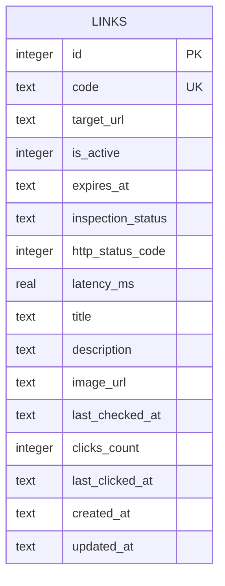

# Database Design — FastURL
_Last updated: 2025-05-22_

## Overview
The FastURL schema models a single domain aggregate — `Link` — which encapsulates a shortened URL association, its operational state, async inspection results, and click metrics. All Value Objects (`ShortCode`, `TargetUrl`, `LinkMetrics`, `LinkInspection`) are embedded as columns in the `links` table, following the domain design decision to keep the schema flat and idiomatic for a single-node SQLite deployment.

## Logical Model

### Entities
| Entity | Description | Key Attributes |
|--------|-------------|----------------|
| `Link` | Aggregate Root: shortened URL with lifecycle, metrics, and inspection state | `code` (unique short code), `target_url`, `is_active`, `expires_at` |

### Relationships
_No inter-entity relationships — the domain has a single Aggregate Root. All Value Objects are embedded._

## Physical Model

### `links`
**Column definitions**

| Column               | Type      | Nullable | Default              | Notes                                          |
|----------------------|-----------|----------|----------------------|------------------------------------------------|
| `id`                 | `INTEGER` | NO       | —                    | Internal PK — never exposed via API            |
| `code`               | `TEXT`    | NO       | —                    | Base62 ShortCode, 7–16 chars — sole public identifier |
| `target_url`         | `TEXT`    | NO       | —                    | Validated destination URL (HTTP/HTTPS)         |
| `is_active`          | `INTEGER` | NO       | `1`                  | Boolean (SQLite integer); soft-delete flag     |
| `expires_at`         | `TEXT`    | YES      | `NULL`               | ISO 8601 datetime; `NULL` = never expires      |
| `inspection_status`  | `TEXT`    | NO       | `'pending_analysis'` | `LinkInspection` VO status                     |
| `http_status_code`   | `INTEGER` | YES      | `NULL`               | HTTP response code from target URL check       |
| `latency_ms`         | `REAL`    | YES      | `NULL`               | Round-trip latency in milliseconds             |
| `title`              | `TEXT`    | YES      | `NULL`               | HTML `<title>` tag of target page              |
| `description`        | `TEXT`    | YES      | `NULL`               | `og:description` or HTML meta description      |
| `image_url`          | `TEXT`    | YES      | `NULL`               | `og:image` URL from target page                |
| `last_checked_at`    | `TEXT`    | YES      | `NULL`               | Timestamp of last inspection execution         |
| `clicks_count`       | `INTEGER` | NO       | `0`                  | `LinkMetrics` VO: total successful redirects   |
| `last_clicked_at`    | `TEXT`    | YES      | `NULL`               | `LinkMetrics` VO: timestamp of last redirect   |
| `created_at`         | `TEXT`    | NO       | `CURRENT_TIMESTAMP`  | Record creation timestamp                      |
| `updated_at`         | `TEXT`    | NO       | `CURRENT_TIMESTAMP`  | Record last-modification timestamp             |

**Constraints**

| Name                      | Type        | Definition                                                          |
|---------------------------|-------------|---------------------------------------------------------------------|
| `PRIMARY KEY`             | PK          | `id`                                                                |
| `uq_links_code`           | UNIQUE      | `code`                                                              |
| `chk_links_code_len`      | CHECK       | `length(code) BETWEEN 7 AND 16`                                     |
| `chk_links_is_active`     | CHECK       | `is_active IN (0, 1)`                                               |
| `chk_links_insp_status`   | CHECK       | `inspection_status IN ('pending_analysis', 'active', 'unreachable')`|
| `chk_links_clicks`        | CHECK       | `clicks_count >= 0`                                                 |

## Design Decisions
1. **Single table, all VOs embedded**: `LinkMetrics` and `LinkInspection` are stored as columns in `links` rather than separate tables. This follows domain design decision #5 — educational clarity and zero JOIN overhead for a single-node SQLite deployment.
2. **`code` as sole public identifier**: `id` (integer) is used only for internal ORM operations and never exposed via the API. `public_id` (UUID) was removed as redundant — the Base62 `code` is already non-sequential and non-enumerable, making it a safe and clean public key without the overhead of a second unique column.
3. **TEXT for datetime in SQLite**: SQLite has no native datetime type; ISO 8601 strings (`TEXT`) are used with `CURRENT_TIMESTAMP` defaults. SQLAlchemy's `DateTime` type maps to this transparently.
4. **Boolean as INTEGER**: SQLite has no native boolean; `CHECK(is_active IN (0,1))` enforces the constraint at the DB level. SQLAlchemy's `Boolean` type maps to this automatically.
5. **`inspection_status` with CHECK constraint**: Bounded enumeration enforced at DB level to guard against invalid states escaping the application layer.

## Normalisation Notes
_Compliant with 3NF for the entity model. Intentional exception:_
- `LinkMetrics` and `LinkInspection` Value Objects are embedded in `links` rather than normalised into separate tables. Justified by the single-aggregate domain model, zero cross-entity FK requirements, and the project's SQLite/demo scope (see domain design decision #5).

## Index Plan
_To be defined once query patterns are known._

## Change Log
| Version | Date       | Change                                                                        |
|---------|------------|-------------------------------------------------------------------------------|
| 0.1     | 2025-05-15 | Initial design — single `links` table with embedded VOs                       |
| 0.2     | 2025-05-22 | Removed `public_id` column — `code` is the sole public identifier             |
