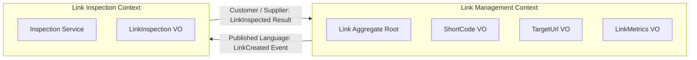

# Domain Design — FastURL
_Last updated: 2025-05-22_

## Overview
FastURL is a high-performance URL shortening and link inspection domain. It provides core capabilities to convert long URLs into compact 7-character Base62 keys, resolve short links via HTTP 307/302 redirects while tracking click metrics, and perform asynchronous, non-blocking health checks and OpenGraph metadata extractions on destination URLs.

## Ubiquitous Language
| Term               | Definition                                                                                                                  | Synonyms to avoid         |
|--------------------|-----------------------------------------------------------------------------------------------------------------------------|---------------------------|
| `Link`             | The primary domain aggregate representing a shortened URL association between a short code and a target destination.       | URL record, Short URL row |
| `ShortCode`        | An immutable, URL-safe alphanumeric identifier (Base62 default 7 chars, or custom alias up to 16 chars) identifying a link. | Key, Slug, Token, Hash    |
| `TargetUrl`        | The destination HTTP or HTTPS web address to which visitors are redirected.                                                 | Original URL, Long URL    |
| `Inspection`       | An asynchronous health check and metadata extraction audit executed on a target URL.                                       | Crawl, Ping, Healthcheck  |
| `InspectionStatus` | State of target URL health: `pending_analysis`, `active`, or `unreachable`.                                                 | Link state, Status        |
| `ClickMetric`      | Quantitative tracking data representing total successful redirections and timestamp of last access.                        | Hits, Counter, Views      |
| `Expiration`       | An optional point in time after which a link ceases to redirect visitors (yielding HTTP 410 Gone).                         | TTL, Deletion date        |

## Entities
### Link (Aggregate Root)
- **Description:** The single primary Entity and Aggregate Root representing the shortened link and its entire lifecycle.
- **Natural key:** `code: str` (unique indexed alphanumeric string).
- **Attributes:**
  - `id: UUID / int` — Internal surrogate identifier.
  - `code: str` — The unique 7-character Base62 code or custom alias (validated via `ShortCode` rules).
  - `target_url: str` — Validated destination URL (validated via `TargetUrl` rules).
  - `is_active: bool` — Operational status flag (active or soft-deleted/disabled).
  - `expires_at: Optional[datetime]` — Point in time when the link expires (lazy expiration).
  - `created_at: datetime` — Timestamp of link creation.
  - `updated_at: datetime` — Timestamp of last modification.
  - `inspection: Optional[LinkInspection]` — Embedded inspection result snapshot.
  - `metrics: LinkMetrics` — Embedded click counter and last access metadata.
- **Lifecycle:**
  - Created via `POST /api/v1/links` in `pending_analysis` state.
  - Updated asynchronously when `LinkInspected` event/task completes.
  - Read & updated (metrics) on public `GET /{code}` redirect.
  - Re-inspected on demand via `POST /api/v1/links/{code}/inspect`.
  - Deactivated / soft-deleted via `DELETE /api/v1/links/{code}`.

## Value Objects / Validated Types
### ShortCode (Validated Type / Value Object)
- **Description:** Encapsulates formatting and validation rules for link codes, enforcing Base62 alphabet (`[a-zA-Z0-9]`), length boundaries (default 7 chars, custom up to 16 chars), and URL safety. In implementation, represented as a validated type constraint (e.g., Pydantic `Annotated[str, ...]`) on the `Link.code` attribute.
- **Attributes:** `value: str`
- **Equality:** Case-sensitive string equality.

### TargetUrl (Validated Type / Value Object)
- **Description:** Encapsulates destination URL validation, enforcing HTTP/HTTPS scheme validation, well-formed syntax, and preventing self-referencing loops back to the FastURL domain.
- **Attributes:** `value: str`
- **Equality:** Normalized URL string equality.

### LinkMetrics
- **Description:** Tracks usage metrics for a link.
- **Attributes:**
  - `clicks_count: int` — Total number of successful redirections (defaults to 0).
  - `last_clicked_at: Optional[datetime]` — Timestamp of the most recent redirect.
- **Equality:** Equal when `clicks_count` and `last_clicked_at` match.

### LinkInspection
- **Description:** Snapshot of target URL health, performance, and OpenGraph/HTML metadata.
- **Attributes:**
  - `status: InspectionStatus` — `pending_analysis`, `active`, or `unreachable`.
  - `http_status_code: Optional[int]` — Target response status (e.g. 200, 404, 500).
  - `latency_ms: Optional[float]` — HTTP round-trip latency in milliseconds.
  - `title: Optional[str]` — HTML `<title>` tag content.
  - `description: Optional[str]` — OpenGraph `og:description` or meta description.
  - `image_url: Optional[str]` — OpenGraph `og:image` URL.
  - `last_checked_at: Optional[datetime]` — Timestamp of inspection execution.
- **Equality:** Equal when all inspection attributes are identical.

## Aggregates
### LinkAggregate
- **Root:** `Link` (Entity)
- **Members:** `code` (validated by `ShortCode`), `target_url` (validated by `TargetUrl`), `LinkMetrics` (VO), `LinkInspection` (VO).
- **Invariants:**
  1. `code` must be unique across all links and conform to Base62 formatting.
  2. `target_url` must be a valid HTTP or HTTPS URL and cannot equal the FastURL base redirect URL.
  3. `expires_at`, if provided at creation, must be in the future (`expires_at > created_at`).
  4. Redirection must not be permitted if `is_active == False` (returns 404) or `now() > expires_at` (returns 410).
  5. Incrementing `clicks_count` must automatically update `last_clicked_at`.

## Domain Events
| Event                        | Trigger                                                          | Payload                                                                        | Consumers                                                  |
|------------------------------|------------------------------------------------------------------|--------------------------------------------------------------------------------|------------------------------------------------------------|
| `LinkCreated`                | Short link successfully persisted                                | `link_id`, `code`, `target_url`, `created_at`                                  | `BackgroundInspector` (dispatches async HTTP health check) |
| `LinkRedirected`             | Visitor accesses short URL and redirect is served                | `code`, `clicked_at`                                                           | `MetricsService` (updates click count & last accessed)     |
| `LinkInspected`              | Background HTTP check & metadata extraction completes            | `link_id`, `status`, `http_status_code`, `latency_ms`, `title`, `description` | `LinkRepository` (updates inspection snapshot)             |
| `LinkReInspectionRequested`  | API client explicitly requests a new background inspection       | `link_id`, `code`, `requested_at`                                              | `BackgroundInspector` (re-dispatches async health check)   |
| `LinkDeactivated`            | Link is deleted/disabled by API client                           | `link_id`, `code`, `deactivated_at`                                            | `CacheService` / Internal state                            |

## Bounded Contexts
### LinkManagement Context
- **Responsibility:** Owns the `Link` aggregate, code generation (Base62 generator), CRUD operations, custom alias verification, link expiration checks, and public redirect resolution.
- **Owns:** `Link` (Root), `ShortCode`, `TargetUrl`, `LinkMetrics`.

### LinkInspection Context
- **Responsibility:** Owns destination URL health auditing, HTTP latency benchmarking, OpenGraph/HTML metadata parsing, and target reachability status classification.
- **Owns:** `LinkInspection`, `InspectionService`, `AsyncHttpClient`.

## Context Map

### Relationships
| From             | Pattern             | To               | Notes                                                                                       |
|------------------|---------------------|------------------|---------------------------------------------------------------------------------------------|
| `LinkManagement` | Published Language  | `LinkInspection` | Publishes `LinkCreated` event containing target URL details for background analysis.        |
| `LinkInspection` | Customer / Supplier | `LinkManagement` | Supplies inspection outcomes (`LinkInspected`) to update the aggregate's inspection snapshot.|

## Design Decisions
1. **Single Entity (`Link`) with Validated Types**: `Link` is the sole Entity / Aggregate Root. `ShortCode` and `TargetUrl` are modelled as validated types (Value Objects) attached directly to `Link` attributes rather than standalone entities or separate tables, keeping the codebase clean and idiomatic for FastAPI.
2. **Base62 7-Character Keyspace**: Auto-generated codes use `[a-zA-Z0-9]` offering ~3.5 trillion combinations, avoiding guessability and URL-encoding issues associated with standard Base64 symbols (`+`, `/`).
3. **Lazy Expiration (410 Gone)**: Expiration checks happen upon resolution (`now() > expires_at`). This avoids complex scheduled purge jobs while guaranteeing expired links stop redirecting.
4. **Decoupled Asynchronous Inspection**: Inspection runs in FastAPI background tasks (`BackgroundTasks`) using `httpx.AsyncClient` without blocking the initial `POST /api/v1/links` HTTP 201 response. The same mechanism is reused for manual re-inspection (`LinkReInspectionRequested`).
5. **Embedded Value Object for Metrics & Inspection**: For educational clarity and single-node SQLite simplicity, `LinkMetrics` and `LinkInspection` are modelled as cohesive parts of the `Link` aggregate rather than separate database tables, while maintaining clean domain separation.
6. **`code` as sole public identifier**: The Base62 `code` is non-sequential and non-enumerable, making a separate `public_id` (UUID) column redundant. The internal `id` (integer PK) is never exposed via the API.

## Open Questions
- In a multi-worker production environment, should domain events be dispatched over an external message queue (e.g. Redis Streams / RabbitMQ)? *(Current decision: in-process FastAPI BackgroundTasks for simplicity and zero external dependencies).*

## Change Log
| Version | Date       | Change                                                                                                        |
|---------|------------|---------------------------------------------------------------------------------------------------------------|
| 0.1     | 2025-05-15 | Initial domain design based on requirements and idea document                                                 |
| 0.2     | 2025-05-15 | Clarified ShortCode and TargetUrl as validated types/VOs on the Link entity, avoiding extra entity overhead   |
| 0.3     | 2025-05-22 | Added `LinkReInspectionRequested` event; added design decision #6 (`code` as sole public identifier)          |
